## Full Ray Tracer
This project is about rendering complex scenes with multiple geometry types, lighting models, and reflections. The journey involved solving several challenges.
All outputs match the provided reference images except the dragon. 

One of the chalenges I faced was the solid color for some of the challenging renderings. Some scenes (like ShadowTest.txt) would render as a single solid color. To solve this, I implemented complete smooth shading support. 

## Compile
g++ -O3 -std=c++11 rayTrace_vec3.cpp -o raytracer
flag -O3 optimized it to run so faster

## Run
./raytracer <text.file>

## Results
# Bottle

  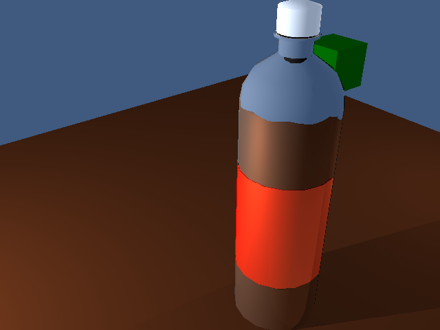

# Dragon

  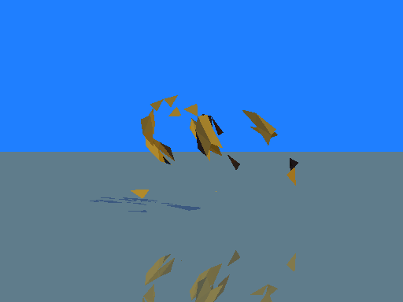

# Foo realistic

  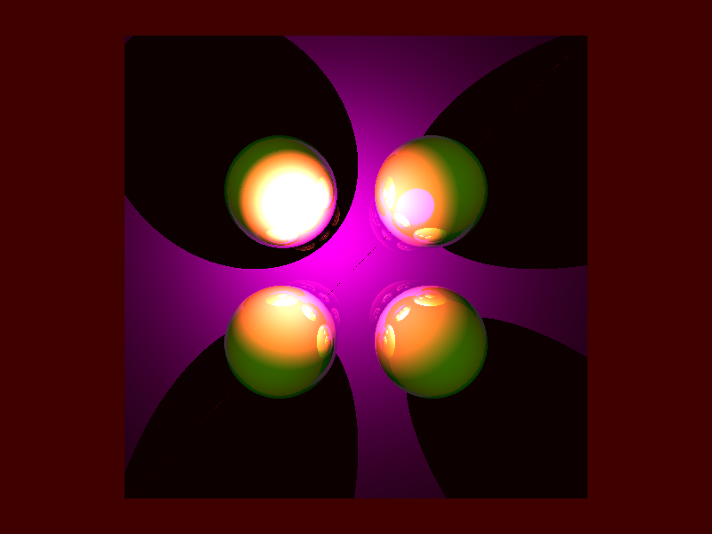

# Foo slow

  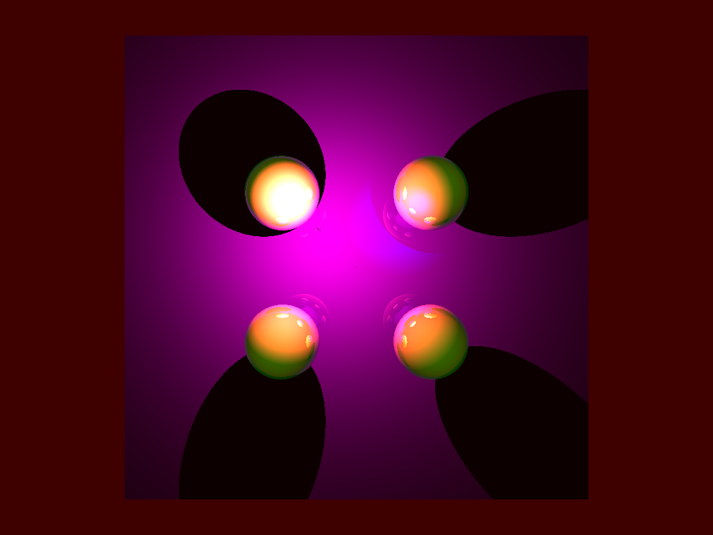

# Gear

  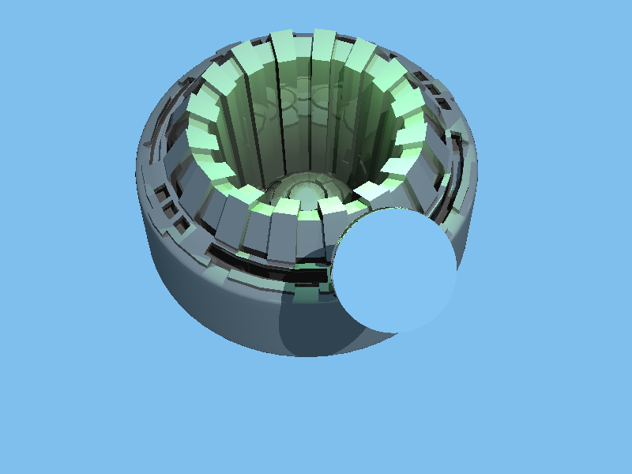

# No Lable

  

# Outdoor 

  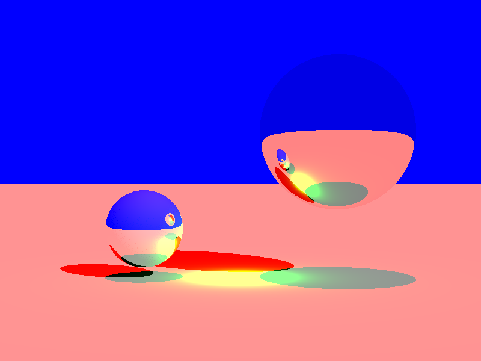

# Plant

  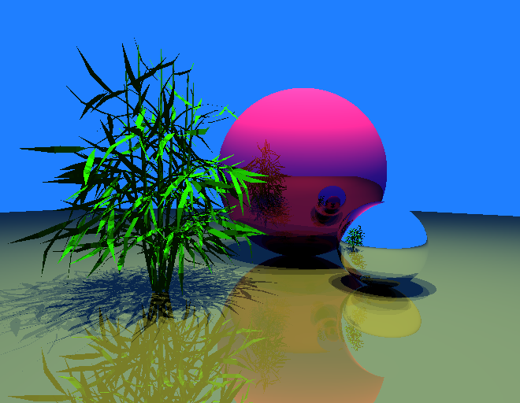

# Reaching hand

  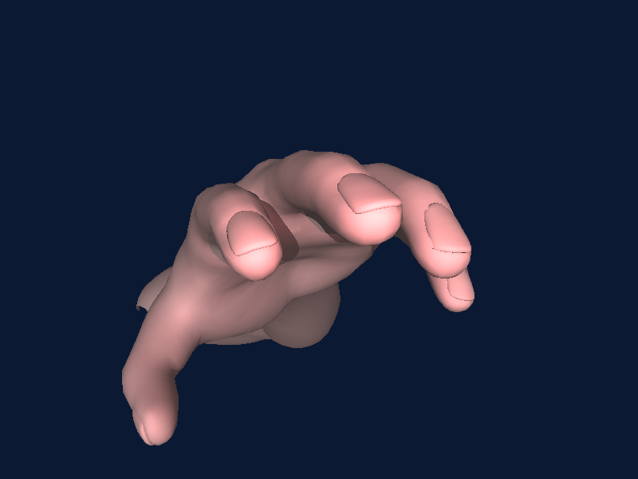

# Arm

  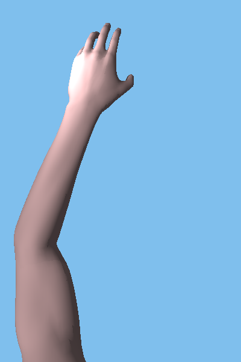

# Shadow Test

  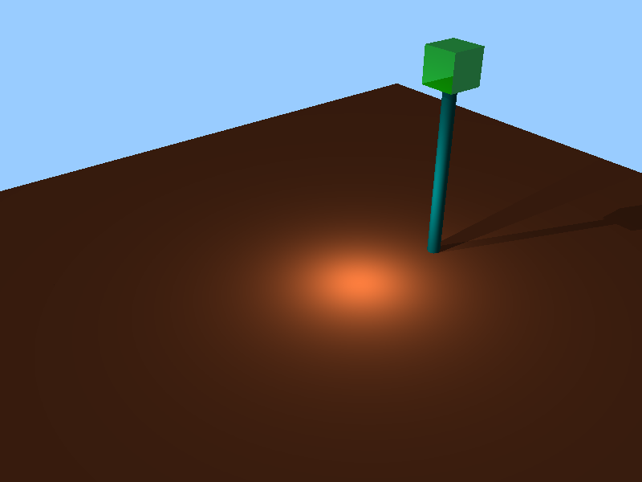

# Triangle 

  

## Bonus

  

# Easy mode

  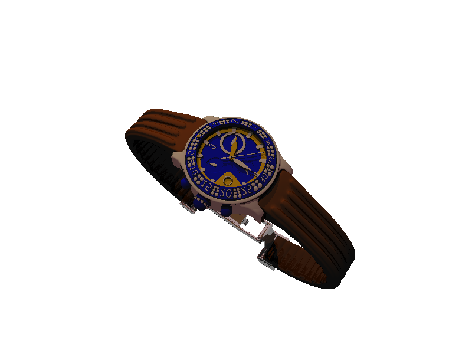

## Implemented Features 
| Feature | Status |
|---------|--------|
| Complex Lighting | Complete | 
| Spot Lights | Complete | 
| HDR Support | Partial |

# Bonus Implementation
Smooth Shading with Per-Vertex Normals

## References 
https://www.scratchapixel.com/lessons/3d-basic-rendering/introduction-to-shading/shading-normals.html
https://www.scratchapixel.com/lessons/3d-basic-rendering/ray-tracing-rendering-a-triangle/moller-trumbore-ray-triangle-intersection.html

# Holoween Plan
Spend Holoween at the MIT Visual Arts Center! 

  

